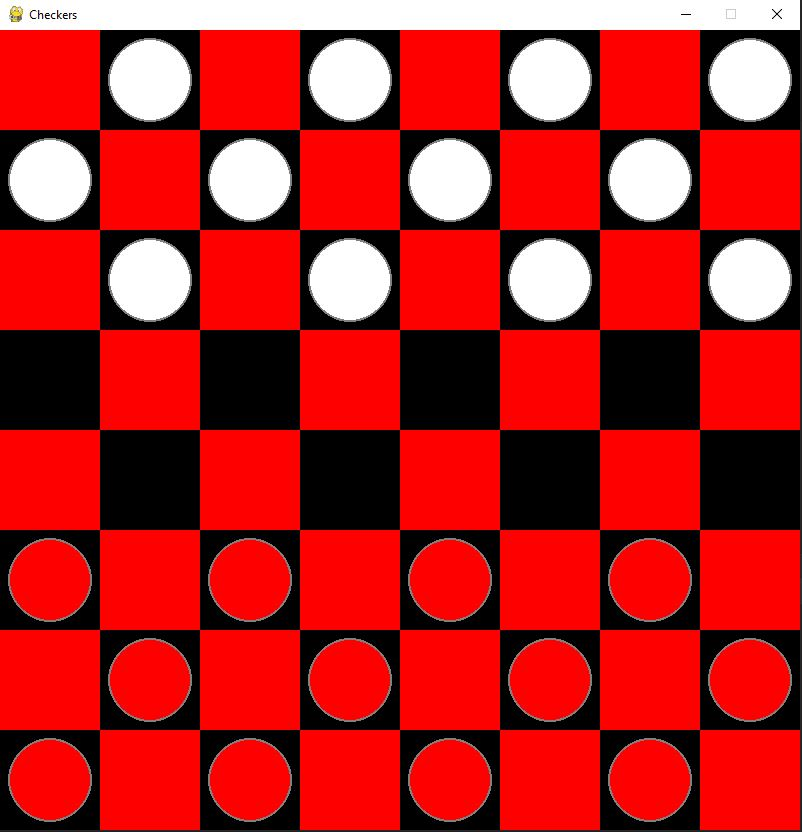
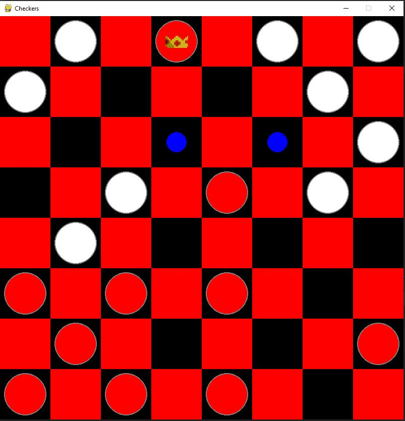

# Checkers
> Checkers game created using python and pygame

## Table of contents
* [General info](#general-info)
* [Screenshots](#screenshots)
* [Technologies](#technologies)
* [Setup](#setup)
* [Features](#features)
* [Status](#status)
* [Inspiration](#inspiration)
* [Contact](#contact)

## General info
Checkers game with board and engine to check if move is valid. Now player can move both red and black pieces as there is no AI implemented.

## Screenshots

## Technologies
* Python - version 3.7
* Pygame

## Setup
To run this project download the files and run the code in any interpreter.

## Features
List of features ready and TODOs for future development:
* Game board created in pygame, with blue dots that shows valid moves
* Engine that chceks if move is valid and if it can be exectuted
* Automaticly changing a piece to "king" after reaching the end of the board

To-do list:
* Implement the AI
* Create game menu and "play again" button
* Fix minor bugs causing some issues with moving pieces in certain locations

## Status
Project is in proggress

## Inspiration
Inspired by youtube channel: Tech With Tim

## Contact
[@Piotr Kowalewski](https://pkow.herokuapp.com) - feel free to contact me!
